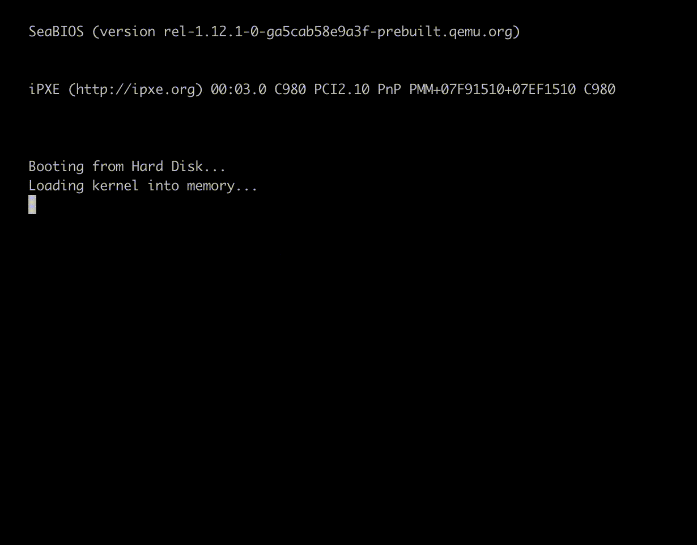
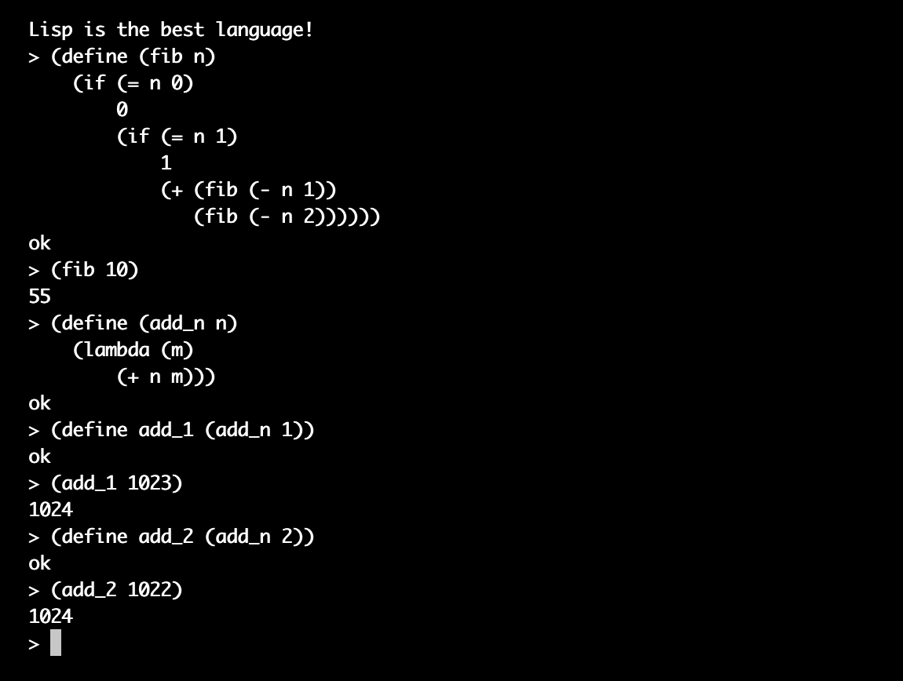
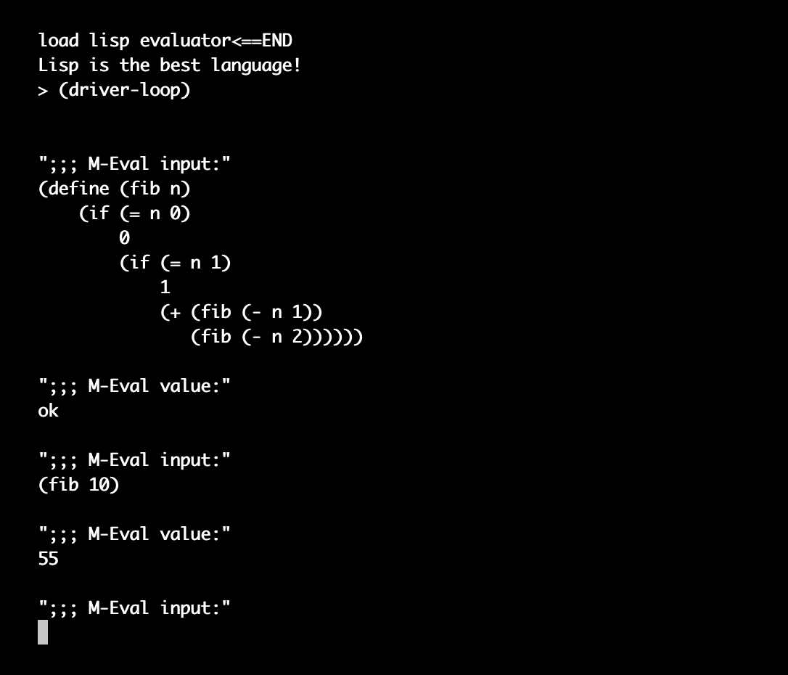

## OS & Lisp

**每位程序员都有自己的 “操作系统”(os) 和 “语言”(lisp) 梦！**

### 简介

实现一个简单的操作系统，只需此操作系统支持 `Lisp` 语言。

开机动画：



开机后启动 `Lisp` 解释器：



`Lisp` 可自举（第一版已实现，即 *lisp_c分支*）：



### 运行

##### 环境

只针对 `i386` 架构，需要交叉编译器、模拟器环境。

下面以 **Mac** 为例：

- 安装模拟器 --> `brew install qemu`

- 安装汇编编译器 --> `brew install nasm`

- 安装交叉编译器

  ```shell
  brew tap nativeos/i386-elf-toolchain
  
  brew install i386-elf-binutils i386-elf-gcc i386-elf-gdb
  ```

##### 执行

`make run`

### 一些说明

分支：

	- `lisp_c` ，此分支使用 C 实现 Lisp，最终 Lisp 已能自举。但是，在执行 Lisp 表达式过程中若出现多于一次的 GC 就极有可能出错（GC 的问题）
	- `lisp_asm` ，此分支使用汇编实现 Lisp，解决 `lisp_c` 中 GC 存在的问题，目前 Lisp 还不能自举（还差一小步）

启动流程：


内容：

- 第 0 扇区
- `GDT` `IDT`
- CPU 与 IO 通信：`MMIO` `PMIO`
- 定时器的原生实现
- 内存管理 -- 分离空闲链表
- “序对池” 实现
- 序对池的垃圾回收 GC —— 停止复制算法
  - 存活对象 —— root 表
  -  如何更新“老”指针
- 字符串常量池实现 —— 哈希表
- 一种错误机制 —— 汇编想怎么跳就怎么跳
- 字符动画

### 目标

- [x] OS's BootLoader
- [x] OS’s Kernel ---- screen | interrupt (keyboard timer) | memory management | boot animation
- [x] Lisp ---- lisp interpreter
- [x] Lisp ---- enable lisp *bootstrapping*
- [x] Lisp ---- optimize lisp (separation of parsing and execution)
- [x] Lisp ---- in order to solve the problems of GC, use assembly to implement Lisp interpreter
- [ ] Lisp ---- lisp compiler

### 参考

- [os-tutorial](https://github.com/cfenollosa/os-tutorial)
- [OSDev](http://www.osdev.org/)
- [SICP](https://book.douban.com/subject/1148282/)
