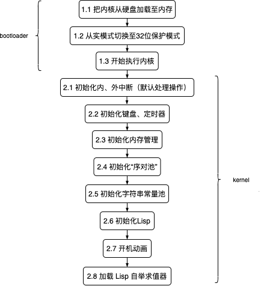

## OS Toy

**或许每个程序员都有一个操作系统梦！**

### 简介

定制的开具动画（还看得过去，gif 有失真）-->


开机后不能傻傻地发呆，跑个 `Lisp` 解释器吧（对 Lisp 情有独钟）-->


`Lisp` 能递归了，有高级函数了，还需怎样才能让它有一丢丢的不平凡，让它可自举吧（揪着自己的辫子举起自己）-->


至此，它可（约）等价于 **图灵机**。

不过，它华丽的一切都归属于 **计算之美**！

### 目标

- [x] OS's BootLoader
- [x] OS’s Kernel ---- screen | interrupt (keyboard timer) | memory management | boot animation
- [x] OS’s Kernel ---- lisp interpreter
- [x] OS’s Kernel ---- support lisp bootstrap
- [ ] OS’s Kernel ---- optimize lisp (separation of parsing and execution)
- [ ] OS’s Kernel ---- lisp compiler

### 运行

##### 环境

本 OS 只针对 `i386` 架构，所以需要交叉编译器、模拟器环境。

下面以 **Mac** 为例：

- 安装模拟器 --> `brew install qemu`

- 安装汇编编译器 --> `brew install nasm`

- 安装交叉编译器

  ```shell
  brew tap nativeos/i386-elf-toolchain
  
  brew install i386-elf-binutils i386-elf-gcc i386-elf-gdb
  ```

##### 执行

`make run`

### 一些说明

启动流程 -->



有点啥 -->

- 第 0 扇区存什么
- `GDT` `IDT`
- CPU 与 IO 通信：`MMIO` `PMIO`
- 定时器的原生实现
- 内存管理 -- 分离空闲链表
- “序对池”实现
- 序对池的垃圾回收 GC —— 停止复制算法
  - 存活对象 —— root 表
  -  如何更新“老”指针
- 字符串常量池实现 —— 哈希表
- 一种错误机制 —— 汇编想怎么跳就怎么跳
- 字符动画

### 参考

- [os-tutorial](https://github.com/cfenollosa/os-tutorial)
- [OSDev](http://www.osdev.org/)
- [SICP](https://book.douban.com/subject/1148282/)

#### 最后

**最后是忘不了的星哥和他的实验室！**