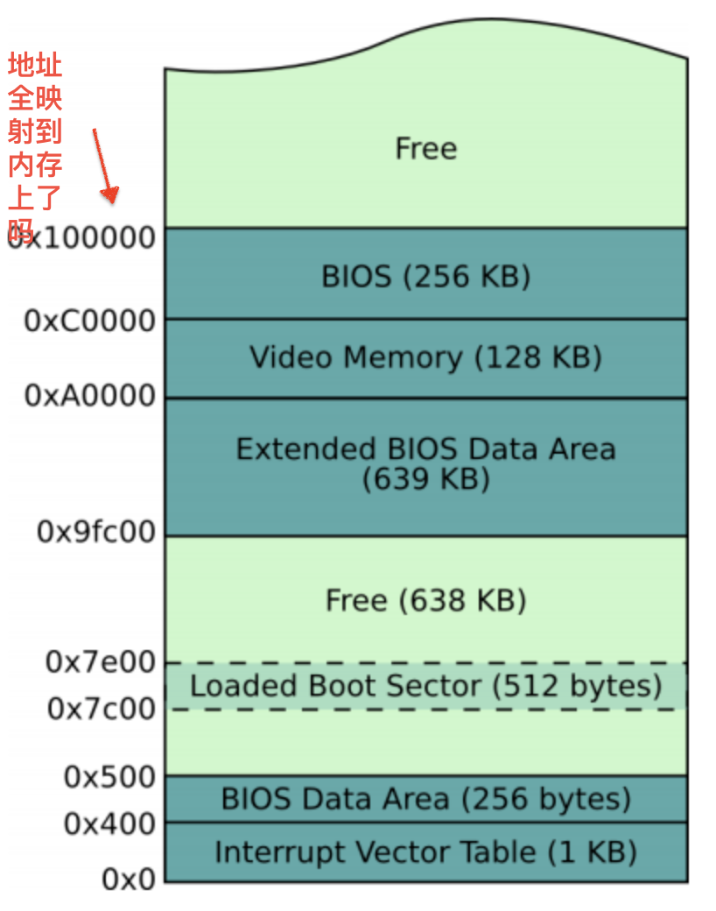

## 疑问及解答

#### 1. os-image.bin 的组成及作用

首先，明确 `.bin` 文件是由 **代码** 和 **数据** 组成的二进制 **内存映射** 文件，这意味着它被加载到内存的过程中内容不用被解析、内容不变。

从 Makefile 文件中，可看到 `os-image.bin` 是由 `boot_sec.bin` 和 `kernel.bin` 拼接而成。所以，`os-image.bin ` 包含了它们的代码和数据。因为 `boot_sec.bin` 的大小为 512 bits（即第 0 扇区），所以从地址 **0x0000200** 开始来源于 `kernel.bin`。由于 `kernel_entry.asm` 是 `kernel.bin` 的入口，所以猜测地址 **0x0000200** 存放的是 `kernel_entry.asm` 对应的机器码。下面对比验证了此：


另外值得一提的是，`os-image.bin` 要被烧录到硬盘 或 flash 类型的 ROM 中。

#### 2. 地址空间的地址全映射到内存上了吗？




参考：[实模式下的1MB内存布局](https://book.51cto.com/art/201604/509566.htm)

#### 3. 段描述符中段限长只有20位，那一段的大小不能超过 1M ？

段描述符数据结构中有个标志为G，但 `G=1` 时，段边界的单位为 **4KBytes**。因而一个段的最大长度可达 **4GBytes**。

参考：[描述符表和描述符高速缓存](http://hengch.blog.163.com/blog/static/107800672009028105929795/)

#### 4. 当前序对的实现方式比较浪费内存，有没有更好的方式？

考虑序对的元素存的都是 **指针**。如此，每个元素的大小可缩小。但，需要考虑指向的内容存在哪里，可能造成 GC 时变得更加麻烦。

#### 5. 可优化之处1 ✅

``` c
typedef struct {
    uint8_t type;                   /* 元素类型 */
    union {
        int32_t ival;               /* 整型 */
        float fval;                 /* 浮点型 */
        char short_string[7];       /* 短字符串 */
        void *point;                /* 指向 长字符串 or 序对，为 0 时表空表或空串 */
    } val;
} element_t;
```

完全可把 短字符串 与 长字符串 的差异屏蔽在 `pair` 的实现内部 --> 在处理子字符串时存在不知道何时字符串结束的问题。

使用字符串应该带长度。

无论多长的字符串都被放在字符串常量池中，使得不再区分长短字符串。

#### 6. 可优化之处2

`float` 的范围较小，这是由 `str2float` 与 `float2str` 所致

#### 7. 疑问：可从硬盘加载的扇区数目

目前最大能加载 82 扇区，感觉此值受限于生成的 `bin` 文件的大小

得到验证，此值就是受限于生成的 `bin` 文件的大小

#### 8. 序对的 GC 中如何判活 -- 见 `pair.c` 中的注释

整体思路是在 “序对池” 的开始维护所有应存活序对的根指针，所有根指针构成一个表。当前面临的问题是确定此根指针表。

根指针表的内容：`exp` `env` 这两个确定有，并且它们的内容可变

#### 9. 可优化之处3

root 表中的 `exp` 指针指的范围能否缩小，以便可 GC 更大空间

#### 10. GC 要点

1. 判存活对象 -- 考虑不全 **(在建)** **(参数)**
2. 更新 -- 更新那些局部引用变量，它们指向可存活的对象，但那些对象现在已经移动了位置 -- 之前未考虑到，导致 **非常大 BUG**
    - 解决方案：从 `car` `cdr` `set_car` `set_cdr` `cons` 上下手，即从选择函数、改变函数上下手 -- 要求 GC 不能过于频繁

#### 11. GC 导致 input_handler 发生变化 ？？ --> ✅

update_stack_top_point 使用错误造成

#### 12. 在一次调用中（调用栈较深）若出现多于两次的 GC ，则可能导致错误

问题根源：GC 要点2

缓解方案：把语法分析与执行相分离，使得语法分析只执行一次

## 少点什么

1. 什么是设计？为什么选这种设计？缺乏设计的合理性实验验证
    - 比如，在 “内存管理” 中，为什么选用 “分离的空闲链表” 这种设计
2. 设计过度与设计缺失
    - 有些东西在一步一步的实现中才发现缺少，这些缺少是因为急于编程还是因为缺乏经验
3. 设计一开始就没想到 pair 会如此重要， `element_t` 串联了有无类型语言（lisp 与 c）

## TODO

1. 添加 `cond` `let` `read` 支持 ✅
2. 自举验证 ✅
3. GC 验证 ✅
4. 如何终止（比如，Stack Overflow）？
5. OS’s Kernel ---- optimize lisp (separation of parsing and execution)
    - 上层优化 `(fib 10)` --> 由 10s 变为 5s
    - 下层优化 --> 需要 C 语言支持闭包
        - 尝试了 GCC 对 C 的扩展 `嵌套函数` --> 其不是真正的闭包
        - Objective-C 的扩展 `Blocks` 真正实现了闭包
        - 放弃
6. 重构？（完全使用汇编实现 Lisp 解释器）
7. OS’s Kernel ---- lisp compiler
